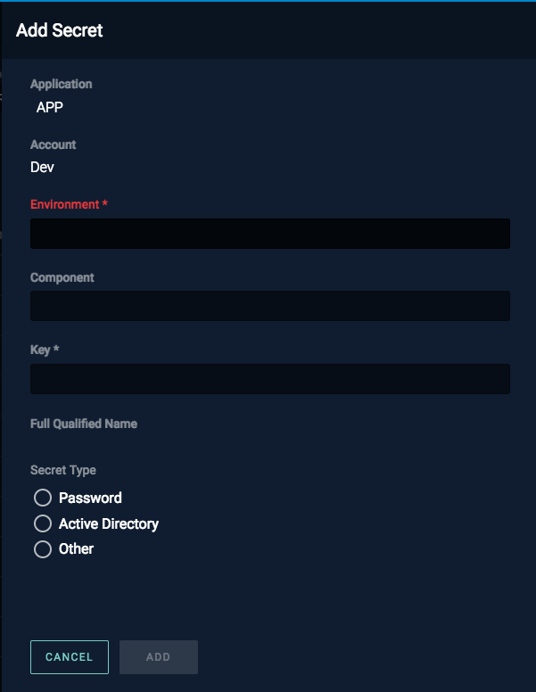

# Adding New Credentials

Once the credentials table has been populated with the contents of a DynamoDB table, users with the proper permissions
will notice that the `+ Add Credential` button towards the top of the table becomes enabled. Clicking this button
displays the Add Credential sidebar, which allows a user to create a new credential.

The Add Credential sidebar is very similar to the Edit Credential sidebar, except that text boxes are now added in the
Environment, Component, and Key sections. 

| Field       	| Description                                                                                                              	|
|-------------	|--------------------------------------------------------------------------------------------------------------------------	|
| Application 	| The Application the secret will be stored under                                                                          	|
| Account     	| The AWS Account alias the secret will be stored under                                                                    	|
| Environment 	| The environment or SDLC you would like to store the secret under                                                         	|
| Component   	| An optional Component field you can add to the secret                                                                    	|
| Secret Type 	| The type of secret to be stored.  This does not change the way the secret is stored.  It is used to provide validation.  	|
| Secret      	| The contents of the secret to be encrypted and stored on DynamoDB under that credential.                                 	|

Click the `Add` button at the bottom of the sidebar to save the new credential.

