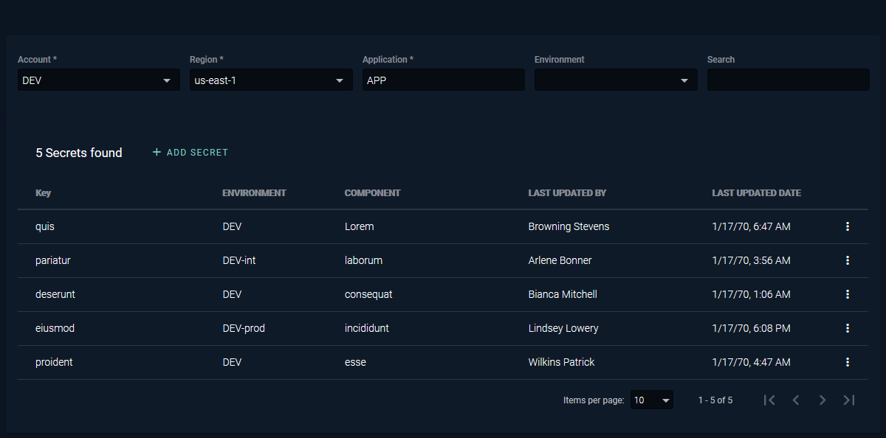

# The Credentials Table

The center point of Fidelius is the credentials table. This is where the credentials residing on DynamoDB
tables will displayed, allowing users to sort, view, and perform various operations on them.

When Fidelius is loaded for the first time, the credentials table will be empty. To populate the table, use the
`Account`, `Region`, and `Application` dropdowns at the top of the table. `Account` and `Region` specify which DynamoDB
table on AWS that you want to access. Credentials stored in Fidelius are organized by applications that they belong to, so
selecting an option under the `Application` menu will retrieve all credentials belonging to the selected application.
Note that you must select an option for all three of `Account`, `Region`, and `Application` in order to retrieve credentials.
The table will populate once selections have been made in all three of those dropdowns.

### Sorting and Filtering Credentials
Fidelius provides a variety of features for sorting and filtering credentials. The two boxes at the top-right of the table
can be used to filter credentials in the credentials table. The `Environment` dropdown contains options for filtering credentials
based on the "Environment" column of the table. Selecting `ALL` in `Environment` will return to the default behavior of
displaying credentials from any environment. Entering text into the `Search` text box will filter credentials that contain the
entered string anywhere in the credential's full name.

To sort the credentials table, click on the column headers on any of the columns in the table.
